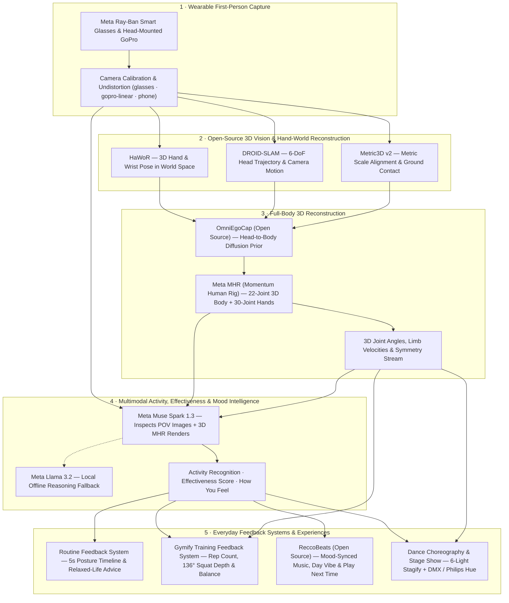

# LifeLens Full End-to-End Pipeline Architecture

```mermaid
graph TD
    subgraph S1["1 · Wearable First-Person Capture"]
      C1["Meta Ray-Ban Smart Glasses & Head-Mounted GoPro"]
      C2["Camera Calibration & Undistortion (glasses · gopro-linear · phone)"]
      C1 --> C2
    end

    subgraph S2["2 · Open-Source 3D Vision & Hand-World Reconstruction"]
      V1["HaWoR — 3D Hand & Wrist Pose in World Space"]
      V2["DROID-SLAM — 6-DoF Head Trajectory & Camera Motion"]
      V3["Metric3D v2 — Metric Scale Alignment & Ground Contact"]
      C2 --> V1 & V2 & V3
    end

    subgraph S3["3 · Full-Body 3D Reconstruction"]
      B1["OmniEgoCap (Open Source) — Head-to-Body Diffusion Prior"]
      B2["Meta MHR (Momentum Human Rig) — 22-Joint 3D Body + 30-Joint Hands"]
      B3["3D Joint Angles, Limb Velocities & Symmetry Stream"]
      V1 & V2 & V3 --> B1 --> B2 --> B3
    end

    subgraph S4["4 · Multimodal Activity, Effectiveness & Mood Intelligence"]
      M1["Meta Muse Spark 1.3 — Inspects POV Images + 3D MHR Renders"]
      M2["Meta Llama 3.2 — Local Offline Reasoning Fallback"]
      M3["Activity Recognition · Effectiveness Score · How You Feel"]
      C2 --> M1
      B2 --> M1
      B3 --> M1
      M1 -.-> M2
      M1 --> M3
    end

    subgraph S5["5 · Everyday Feedback Systems & Experiences"]
      E1["Routine Feedback System — 5s Posture Timeline & Relaxed-Life Advice"]
      E2["Gymify Training Feedback System — Rep Count, 136° Squat Depth & Balance"]
      E3["ReccoBeats (Open Source) — Mood-Synced Music, Day Vibe & Play Next Time"]
      E4["Dance Choreography & Stage Show — 6-Light Stagify + DMX / Philips Hue"]
      M3 --> E1 & E2 & E3 & E4
      B3 --> E2 & E4
    end
```
